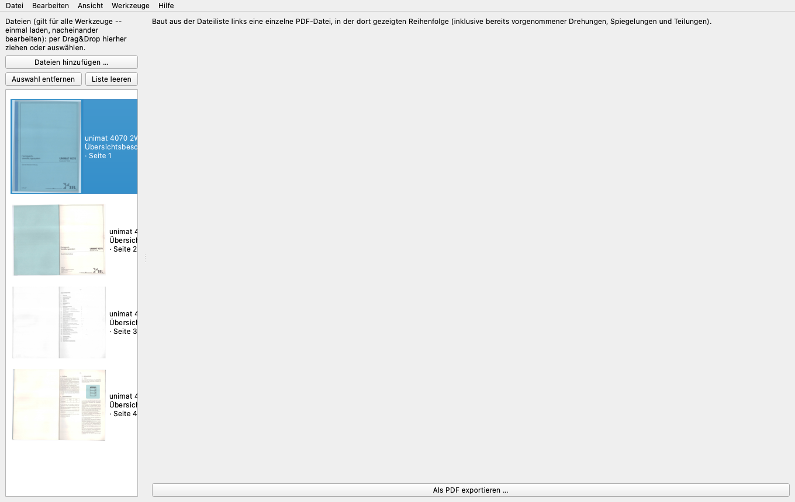

# Mathias' kleines PDF-Werkzeug

Eine grafische Anwendung zum Nachbearbeiten gescannter Dokumente -- für
macOS und Windows, ohne dass irgendein zusätzliches Programm installiert
werden muss.

*A graphical tool for post-processing scanned documents -- for macOS and
Windows, with no additional software to install.*

Kostenlos bereitgestellt von [Telefonanleitungen.de](https://www.telefonanleitungen.de).



## Was es kann / What it does

Fügt Seiten aus verschiedenen Dateien zu einer PDF zusammen, dreht schief
gescannte Seiten gerade, trennt mehrere Seiten aus einem einzelnen Scan,
fügt umgekehrt mehrere Teile (z. B. A4-Scans einer A1-Zeichnung) zu einer
großen Seite zusammen, bringt gescannte Doppelseiten aus gehefteten
Broschüren automatisch in die richtige Lesereihenfolge, ordnet eine
durcheinandergeratene Seitenfolge neu, bringt Seiten auf ein exaktes
DIN-Format oder Maß in mm (inkl. automatischem Abschneiden schwarzer
Scan-Ränder), zerlegt eine PDF in einzelne Bilddateien und verkleinert die
Dateigröße großer Scans deutlich. Alles in einer einzigen App, ohne
Internetverbindung und ohne zusätzliche Software.

*Combines pages from different files into one PDF, straightens crooked
scans, splits multiple pages out of a single scan, conversely merges
several parts (e.g. A4 scans of an A1 drawing) into one large page,
automatically puts scanned saddle-stitch booklet spreads back into the
correct reading order, reorders a scrambled page sequence, brings pages
to an exact DIN format or size in mm (including automatically cropping
black scan borders), breaks a PDF apart into individual image files, and
substantially shrinks the file size of large scans. All in one app, no
internet connection and no additional software required.*

## Funktionen / Features

- **PDF erstellen** -- PDF/JPG/BMP/TIF(F) (auch mehrseitige TIFFs) zu einer
  PDF-Datei zusammenfügen.
  *Combine PDF/JPG/BMP/TIF(F) files (including multi-page TIFFs) into one PDF.*
- **Seiten drehen** -- frei mit der Maus gerade ziehen, oder 90°/180°,
  Spiegeln, "abwechselnd drehen" für gescannte Doppelseiten; Schräglage
  lässt sich auch automatisch per Textzeilen-Erkennung vorschlagen.
  *Rotate pages freehand by dragging, or by 90°/180°, mirror, or
  alternate rotation for scanned spreads; skew can also be suggested
  automatically via text-line detection.*
- **Bildbereinigung** -- für gescannte Schwarzweiß-/Textvorlagen:
  Binarisieren (Schwellwert, auf Wunsch automatisch per Otsu-Verfahren
  vorgeschlagen) und Despeckle (kleine dunkle Flecken/Staub entfernen),
  beide Schritte unabhängig voneinander zuschaltbar, mit Live-Vorschau.
  *Image cleanup for scanned black-and-white/text originals: binarizing
  (threshold, optionally auto-suggested via Otsu's method) and
  despeckling (removing small dark specks/dust), both steps
  independently toggleable, with a live preview.*
- **Seiten teilen** -- beliebiges Raster aus Zeilen × Spalten, Schnittlinien
  mit der Maus ziehen, automatische Ausrichtung auf ruhige Bildbereiche.
  *Split a page into an arbitrary row × column grid, drag the cut lines by
  hand, with automatic alignment to quiet image areas.*
- **Seiten zusammenfügen** -- mehrere Teile (z. B. A4-Scans einer großen
  Zeichnung) zu einer Seite verbinden: Raster-Anordnung, frei verschiebbar,
  Feindrehung und Randbeschnitt je Teil.
  *Combine several parts (e.g. A4 scans of a large drawing) into one page:
  grid layout, freely draggable, per-part fine rotation and edge crop.*
- **Heftseiten teilen** -- gescannte Doppelseiten aus gehefteten Broschüren
  automatisch in die richtige Reihenfolge bringen (inkl. überbreiter
  Umschlag-/Aufklappseiten).
  *Automatically reorder scanned saddle-stitch booklet spreads into the
  correct page sequence (including overwide cover/foldout pages).*
- **Seiten nummerieren** -- eine durcheinandergeratene Seitenfolge per
  Zielnummer neu anordnen, plus automatische Sortierung/Umbenennung nach
  Aufnahmedatum.
  *Rearrange a scrambled page sequence by assigning target numbers, plus
  automatic sorting/renaming by capture date.*
- **Seitenmaß normieren** -- Seiten auf ein exaktes DIN-A-Format, ein
  US-Format (Letter, Legal, …) oder ein freies Maß bringen (Millimeter
  oder Zoll, umstellbar in den Einstellungen); schwarze Scan-Ränder werden
  dabei automatisch erkannt und abgeschnitten, inkl. Größenvorschlag je
  Seite.
  *Normalize pages to an exact DIN A format, a US format (Letter, Legal,
  …), or a free size (millimeters or inches, switchable in Preferences);
  black scan borders are automatically detected and cropped, including a
  per-page size suggestion.*
- **Seiten zuschneiden** -- Seiten von allen vier Rändern aus um ein frei
  wählbares Maß beschneiden (z. B. einen Lochrandstreifen oder Heftrand
  entfernen), mit ziehbaren Linien in der Vorschau und Live-Anzeige der
  Ergebnisgröße inkl. Formatvorschlag.
  *Crop pages on all four edges by a freely chosen amount (e.g. to remove
  a punch-hole strip or binding margin), with draggable lines in the
  preview and a live display of the resulting size including a format
  suggestion.*
- **PDF in Bilder teilen** -- als einzelne durchnummerierte Bilddateien oder
  als eine mehrseitige TIFF-Datei exportieren.
  *Export as individually numbered image files or as one multi-page TIFF.*
- **PDF verkleinern & PDF/A** -- Dateigröße durch JPEG-Kodierung deutlich
  verringern (erkennt bereits effizient komprimierte Schwarzweißseiten und
  lässt sie unverändert), verlustfreie Struktur-Komprimierung, sowie
  PDF/A-2b-Kennzeichnung für die Archivierung.
  *Substantially shrink file size via JPEG encoding (detects already
  efficiently compressed black-and-white pages and leaves them untouched),
  lossless structural compression, and PDF/A-2b marking for archival.*
- **Lesezeichen setzen** -- für Broschüren/Bücher jeder Seite optional
  einen Kapitel- oder Unterkapitel-Titel geben, wird beim Speichern
  automatisch zu einem Lesezeichen/Inhaltsverzeichnis in der PDF-Datei.
  *For booklets/books, optionally give each page a chapter or
  sub-chapter title -- automatically becomes a bookmark/table of
  contents in the PDF file when saving.*
- **Metadaten bearbeiten** -- dokumentweite PDF-Metadaten (Titel, Autor,
  Anbieter, Produkt, Version, Releasedatum, Stichwörter) statt pro
  Seite; wird beim Speichern automatisch übernommen, inkl. automatischem
  Dateinamen-Vorschlag beim Speichern unter.
  *Document-wide PDF metadata (title, author, provider, product,
  version, release date, keywords) instead of per page; applied
  automatically when saving, including an automatic filename suggestion
  for Save As.*

Alle Werkzeuge arbeiten auf derselben gemeinsamen Dateiliste -- einmal
laden, mit mehreren Werkzeugen nacheinander bearbeiten, ohne zwischendurch
exportieren zu müssen. Dazu: natives Menü mit Datei schließen/Speichern/
Speichern unter/Rückgängig/Wiederholen (fragt bei ungespeicherten
Änderungen nach), Drag & Drop an eine bestimmte Stelle in der Dateiliste,
Fortschrittsanzeigen bei allen längeren Vorgängen.

*All tools operate on the same shared file list -- load once, work through
several tools one after another without exporting in between. Plus: a
native menu with Close file/Save/Save As/Undo/Redo (asks for confirmation
on unsaved changes), drag & drop insertion at a specific spot in the file
list, and progress indicators for every longer-running operation.*

Die Oberfläche ist auf Deutsch und Englisch verfügbar (in den
Einstellungen umstellbar, Deutsch bleibt die Voreinstellung), dazu eine
frei wählbare Maßeinheit (mm/Zoll) für "Seitenmaß normieren" -- beides
absichtlich nicht an die Systemsprache gekoppelt, da bearbeitete PDFs aus
jedem Land stammen können.

*The interface is available in German and English (switchable in
Preferences, German stays the default), plus a freely selectable
measurement unit (mm/inch) for "Normalize page size" -- both deliberately
not tied to the system language, since the PDFs being edited can come
from any country.*

## Systemvoraussetzungen / System requirements

- **macOS** 11 (Big Sur) oder neuer, 64-Bit (Apple Silicon oder Intel).
  *macOS 11 (Big Sur) or later, 64-bit (Apple Silicon or Intel).*
- **Windows** 10 (64-Bit) oder neuer.
  *Windows 10 (64-bit) or later.*
- Ca. 250 MB freier Speicherplatz für die App, zusätzlich freier Platz für
  Zwischendateien während der Bearbeitung (grob das 2--3fache der Größe
  der bearbeiteten PDF-Dateien).
  *About 250 MB free disk space for the app, plus free space for temporary
  files while working (roughly 2--3x the size of the PDF files being
  processed).*
- Keine Internetverbindung nötig, keine zusätzliche Software (kein
  Python, kein ImageMagick/Ghostscript o. ä.) -- vollständig eigenständig.
  *No internet connection needed, no additional software (no Python, no
  ImageMagick/Ghostscript etc.) -- fully self-contained.*

## Hinweis zu Windows / Note on Windows

Entwickelt und getestet wird ausschließlich auf macOS -- die Windows-Version
wird nicht selbst getestet, funktioniert aber hoffentlich fehlerfrei. Bei
Fehlern bitte mit einer genauen, nachvollziehbaren Beschreibung an
[telefonmann@telefonanleitungen.de](mailto:telefonmann@telefonanleitungen.de)
schreiben, dann wird so schnell wie möglich korrigiert.

*Developed and tested exclusively on macOS -- the Windows version is not
tested by the author, but hopefully works correctly. If you run into a bug,
please report it with a precise, reproducible description to
[telefonmann@telefonanleitungen.de](mailto:telefonmann@telefonanleitungen.de),
and it will be fixed as soon as possible.*

## Installation

### Vorgefertigte Version / Pre-built version

Siehe [Releases](../../releases) für eine fertige macOS-App (.dmg) bzw.
Windows-exe, falls vorhanden.

*See [Releases](../../releases) for a ready-to-run macOS app (.dmg) or
Windows exe, if available.*

### Selbst bauen / Build from source

Voraussetzung: Python 3.11--3.13.

```bash
git clone <URL dieses Repositories>
cd app
python3 -m venv .venv
source .venv/bin/activate      # Windows: .venv\Scripts\activate
pip install -r requirements.txt
python -m pdfkrams.main
```

Eine eigenständige App/exe bauen -- unter macOS `./build_mac.sh`, unter
Windows `build_windows.bat` per Doppelklick ausführen. Beide installieren
alle Abhängigkeiten automatisch in eine eigene virtuelle Umgebung und
bauen dann mit [PyInstaller](https://pyinstaller.org/).

*To build a standalone app/exe -- on macOS run `./build_mac.sh`, on
Windows double-click `build_windows.bat`. Both automatically install all
dependencies into their own virtual environment and then build with
[PyInstaller](https://pyinstaller.org/).*

## Technik / Tech stack

- [PySide6](https://pypi.org/project/PySide6/) (Qt für Python) -- Oberfläche
- [PyMuPDF](https://pypi.org/project/pymupdf/) -- PDF lesen/schreiben/rendern
- [Pillow](https://pypi.org/project/pillow/) -- Bildverarbeitung inkl. TIFF
- [pikepdf](https://pypi.org/project/pikepdf/) -- PDF/A-Metadaten
- [numpy](https://pypi.org/project/numpy/) -- Bildanalyse (Schräglagenerkennung, Bildbereinigung)

Bewusst ohne jede externe Kommandozeilen-Abhängigkeit (kein ImageMagick,
kein Ghostscript) -- alles reine Python-Bibliotheken, damit sich eine
vollständig eigenständige App/exe bauen lässt.

*Deliberately built without any external command-line dependency (no
ImageMagick, no Ghostscript) -- pure Python libraries only, so a fully
self-contained app/exe can be built.*

## Lizenz / License

[GNU General Public License v3.0](LICENSE)
